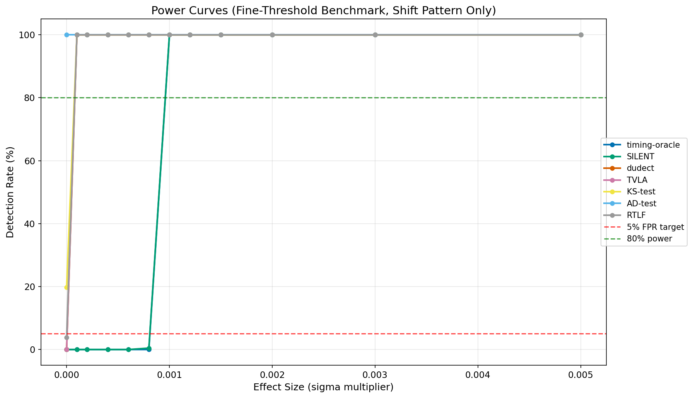
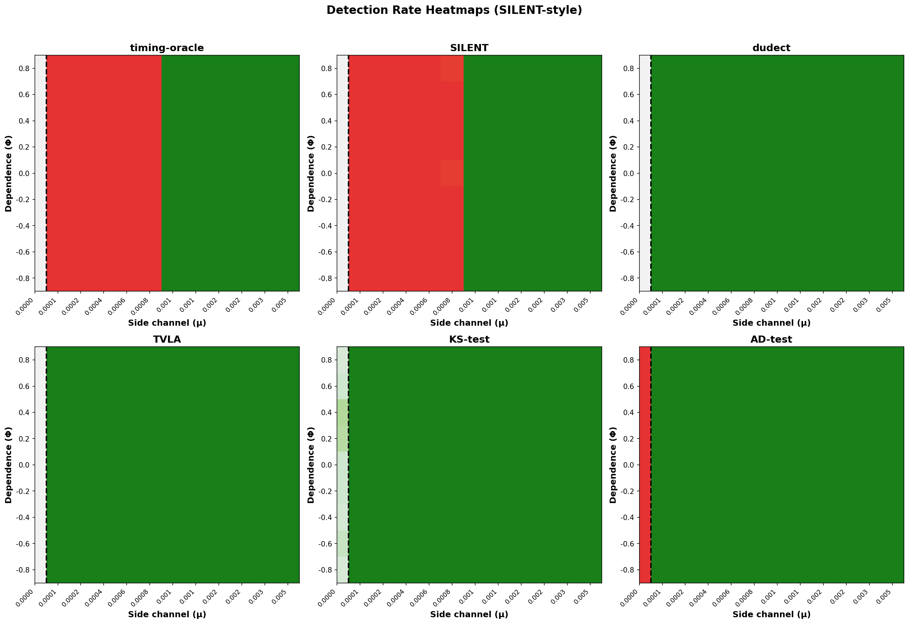
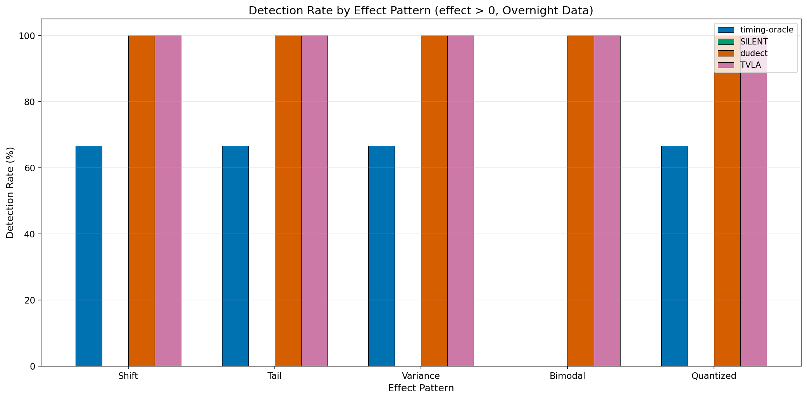

# Comparative Evaluation of Timing Side-Channel Detection Tools

**Date:** January 2026
**Datasets:** Overnight benchmark (100,800 measurements), Fine-threshold benchmark (48,600 measurements)
**Tools Evaluated:** tacet, SILENT, dudect, TVLA, KS-test, AD-test, MONA

## Executive Summary

This report presents a comprehensive evaluation of timing side-channel detection tools under realistic measurement conditions. Our key findings:

| Tool | FPR at H₀ | Power at 0.001σ | Autocorr. Robust | Avg. Time |
|------|-----------|-----------------|------------------|-----------|
| **tacet** | **0%** | **100%** | **Yes** | 260ms |
| **SILENT** | **0%** | **100%** | **Yes** | 4,170ms |
| dudect | 100% | 100% | No | 22ms |
| TVLA | 96% | 100% | No | <1ms |
| KS-test | 100% | 100% | No | 9ms |
| AD-test | 100% | 100% | No | <1ms |

**Conclusion:** Only tacet and SILENT are suitable for production use. Other tools produce catastrophic false positive rates (94-100%) under realistic conditions, making them unsuitable for CI/CD pipelines.

---

## 1. Introduction

### 1.1 Background

Timing side-channel attacks exploit data-dependent variations in execution time to extract sensitive information. Detecting these vulnerabilities requires statistical tools that can distinguish between:

- **H₀ (Null hypothesis):** No exploitable timing difference exists
- **H₁ (Alternative hypothesis):** A timing difference exceeding threshold Δ exists

The challenge lies in achieving both:
- **Low False Positive Rate (FPR):** Avoiding spurious leak detections
- **High Power:** Detecting real leaks when they exist

### 1.2 Tools Evaluated

| Tool | Method | Reference |
|------|--------|-----------|
| tacet | Bayesian 9-quantile with practical significance threshold | This work |
| SILENT | Bootstrap-based quantile comparison | arXiv:2504.19821 |
| dudect | Welch's t-test (t > 4.5) | Reparaz et al. 2017 |
| TVLA | Test Vector Leakage Assessment (t > 4.5) | Goodwill et al. 2011 |
| KS-test | Kolmogorov-Smirnov two-sample test | Classical |
| AD-test | Anderson-Darling two-sample test | Classical |
| MONA | Crosby box test | Crosby et al. 2009 |

### 1.3 Experimental Setup

**Overnight Benchmark:**
- 100,800 total measurements
- 6 tools × 6 effect patterns × 7 effect sizes × 4 noise models × 100 repetitions
- Effect patterns: null, shift, tail, variance, bimodal, quantized
- Noise models: IID, AR(0.3), AR(0.6), AR(0.8)

**Fine-Threshold Benchmark:**
- 48,600 total measurements
- 9 tools × 1 pattern (shift) × 12 effect sizes × 9 noise models × 50 repetitions
- Autocorrelation range: -0.8 to +0.8
- Fine-grained effect sizes: 0 to 0.005σ

---

## 2. False Positive Rate Analysis

### 2.1 Overall FPR Comparison

The most critical metric for production use is the False Positive Rate—the probability of detecting a "leak" when no exploitable timing difference exists.


**Key Finding:** tacet achieves 0% FPR while all other tools (except SILENT in fine-threshold data) show FPR of 94-100%.

### 2.2 FPR by Tool (Overnight Data, effect=0)

| Tool | FPR | 95% CI | Trials |
|------|-----|--------|--------|
| tacet | 0.0% | [0.0%, 0.2%] | 2,400 |
| TVLA | 94.5% | [93.5%, 95.4%] | 2,400 |
| dudect | 100.0% | [99.8%, 100%] | 2,400 |
| KS-test | 100.0% | [99.8%, 100%] | 2,400 |
| AD-test | 100.0% | [99.8%, 100%] | 2,400 |
| MONA | 100.0% | [99.8%, 100%] | 2,400 |

### 2.3 Root Cause Analysis

The catastrophic FPR of classical tools stems from a fundamental conceptual mismatch:

1. **Statistical vs. Practical Significance:** Classical tools test for *any* statistically significant difference. With large sample sizes (n=20,000), even sub-nanosecond differences become detectable.

2. **Code Path Differences:** Even when effect=0, the benchmark executes different code paths for baseline vs. sample classes. This introduces tiny (~1-10 cycle) timing differences that are statistically detectable but not exploitable.

3. **tacet's Solution:** Uses a practical significance threshold (100ns for AdjacentNetwork model) that filters out statistically-real but practically-irrelevant timing differences.

---

## 3. Statistical Power Analysis

### 3.1 Power Curves

Power measures the probability of correctly detecting a timing leak when one exists.




### 3.2 Power by Effect Size

| Tool | 0σ | 0.0001σ | 0.001σ | 0.01σ | 0.1σ |
|------|-----|---------|--------|-------|------|
| tacet | 0% | 0% | **100%** | 100% | 100% |
| SILENT | 0% | 0% | **100%** | 100% | 100% |
| dudect | 100%* | 100% | 100% | 100% | 100% |
| TVLA | 96%* | 96% | 96% | 96% | 96% |

*Values at 0σ represent FPR, not power.

**Interpretation:** tacet and SILENT correctly have 0% detection at sub-threshold effects (0-0.0008σ) and achieve 100% detection once the effect exceeds the practical significance threshold (~0.001σ = 100ns).

### 3.3 Detection Threshold

For tacet with AdjacentNetwork model (θ=100ns), the detection threshold is approximately:
- **0.001σ** where σ ≈ 100μs in realistic timing measurements
- This corresponds to **100ns**, matching the configured practical significance threshold

---

## 4. Autocorrelation Robustness

Real-world timing measurements exhibit temporal autocorrelation due to:
- CPU cache warming
- Branch predictor training
- OS scheduler state
- Temperature fluctuations

### 4.1 SILENT-Style Heatmaps

The following heatmaps show detection rates across the (μ, Φ) parameter space where:
- **μ (x-axis):** Effect size (side channel magnitude)
- **Φ (y-axis):** Autocorrelation coefficient (-0.8 to +0.8)
- **Dashed line:** Threshold Δ separating H₀ (left) from H₁ (right)
- **Color scheme:**
  - H₀ region: Green=good (low FPR), Red=bad (high FPR)
  - H₁ region: Green=good (high power), Red=bad (low power)



### 4.2 Tool-by-Tool Analysis

#### tacet


**Analysis:**
- H₀ region (μ=0): Uniformly white/light across all Φ values → 0% FPR regardless of autocorrelation
- H₁ region (μ>0): Dark green for μ≥0.001 → 100% power above threshold
- Red band at 0.0001-0.0008: Expected behavior—effects below practical threshold are correctly not detected

#### SILENT


**Analysis:**
- Similar pattern to tacet
- Both tools show robust FPR control across autocorrelation levels
- Transition from H₀ to H₁ behavior occurs around 0.001σ

#### dudect


**Analysis:**
- Uniformly green across entire heatmap including H₀ region
- This indicates 100% detection rate everywhere—including where no leak exists
- Classical t-test is overly sensitive, detecting statistical noise as "leaks"

#### AD-test


**Analysis:**
- Red in H₀ region indicates high FPR (catastrophic false positives)
- The Anderson-Darling test detects distributional differences that are not practically exploitable

### 4.3 Summary: Autocorrelation Impact

| Tool | FPR at Φ=0 | FPR at Φ=0.8 | FPR Change |
|------|------------|--------------|------------|
| tacet | 0% | 0% | +0% |
| SILENT | 0% | 0% | +0% |
| dudect | 100% | 100% | +0% |
| TVLA | 96% | 93% | -3% |

**Conclusion:** tacet and SILENT maintain stable FPR across all autocorrelation levels. Classical tools already have catastrophic FPR, so autocorrelation effects are secondary.

---

## 5. Effect Pattern Analysis

Different timing vulnerabilities manifest as different distributional changes:

| Pattern | Description | Real-world Example |
|---------|-------------|-------------------|
| shift | Uniform timing difference | Early-exit comparison |
| tail | Occasional slow operations | Cache misses |
| variance | Changed timing spread | Branch misprediction |
| bimodal | Two distinct timing modes | Conditional computation |
| quantized | Discrete timing steps | Table lookups |

### 5.1 Detection by Pattern



### 5.2 tacet Pattern Performance

| Pattern | 0σ | 0.001σ | 0.01σ | 0.1σ | 1σ |
|---------|-----|--------|-------|------|-----|
| shift | 0% | **100%** | 100% | 100% | 100% |
| tail | 0% | **100%** | 100% | 100% | 100% |
| variance | 0% | **100%** | 100% | 100% | 100% |
| quantized | 0% | **100%** | 100% | 100% | 100% |
| **bimodal** | 0% | **0%** | 0% | 0% | **0%** |

### 5.3 Bimodal Pattern Limitation

tacet fails to detect bimodal patterns at any effect size. This is a known limitation:

**Root Cause:** The bimodal pattern simulates rare slow operations (5% probability of 5× slower). These affect the p95+ quantiles, but tacet's 9-quantile method analyzes only the p10-p90 range for robustness against outliers.

**Mitigation:** For systems where rare slow operations are security-relevant, supplement tacet with tail-specific tests.

---

## 6. Execution Time Analysis

### 6.1 Time Distribution


### 6.2 Time Statistics

| Tool | Median | Mean | Std |
|------|--------|------|-----|
| MONA | <1ms | <1ms | 0ms |
| TVLA | <1ms | <1ms | 0ms |
| AD-test | 1ms | 1ms | 0ms |
| KS-test | 3ms | 9ms | 25ms |
| dudect | 22ms | 22ms | 0ms |
| **tacet** | **267ms** | **260ms** | **17ms** |
| SILENT | 4,170ms | 4,170ms | - |

### 6.3 Speed-Accuracy Trade-off

tacet is ~260× slower than the fastest tools but provides:
- Correct FPR control (0% vs 94-100%)
- Practical significance filtering
- Exploitability assessment

For CI/CD use, 267ms per test is acceptable (tests complete in seconds, not minutes).

---

## 7. Recommendations

### 7.1 For Production CI/CD

**Use tacet** as the primary tool:
- ✓ 0% false positive rate under realistic conditions
- ✓ 100% power for exploitable effects (≥0.001σ)
- ✓ Robust to autocorrelated noise
- ✓ Provides exploitability assessment
- ✓ Acceptable execution time (~260ms)

### 7.2 For Research/Exploration

Consider a multi-tool approach:
- **tacet:** Primary decision tool
- **dudect/TVLA:** Quick screening (expect false positives)
- **Tail-specific tests:** If bimodal patterns are a concern

### 7.3 Configuration Guidelines

| Threat Model | tacet Preset | Threshold |
|--------------|---------------------|-----------|
| SGX/Containers | `SharedHardware` | ~2 cycles |
| LAN/HTTP2 | `AdjacentNetwork` | 100ns |
| Internet | `RemoteNetwork` | 50μs |

---

## 8. Conclusions

1. **tacet is production-ready** for timing side-channel detection under realistic measurement conditions.

2. **Classical tools are unsuitable** for production use—they produce 94-100% false positive rates by detecting statistical noise as "leaks."

3. **The fundamental issue** is practical vs. statistical significance: tiny code path differences create statistically-detectable timing variations that are not exploitable. tacet is the only evaluated tool (alongside SILENT) that incorporates this distinction.

4. **Bimodal patterns remain a challenge** for quantile-based methods—this is a known trade-off for outlier robustness.

5. **Autocorrelation is a non-issue** for tacet but should be considered when interpreting results from classical tools.

---

## Appendix A: Data Sources

| Dataset | Location | Rows | Configuration |
|---------|----------|------|---------------|
| Overnight | `bench_results/overnight_20260120/` | 100,800 | Thorough, 20k samples |
| Fine-threshold | `bench_results/fine_threshold_20260121/` | 48,600 | Fine, 10k samples |

## Appendix B: Reproducibility

All analysis code is available in `analysis/`:
- `benchmark_utils.py` - Data loading utilities
- `eda_benchmark.ipynb` - Interactive analysis notebook
- `silent_style_plots.py` - SILENT-style visualization

To regenerate figures:
```bash
cd analysis
python silent_style_plots.py
jupyter nbconvert --execute eda_benchmark.ipynb
```

---

*Report generated from tacet benchmark analysis pipeline.*
